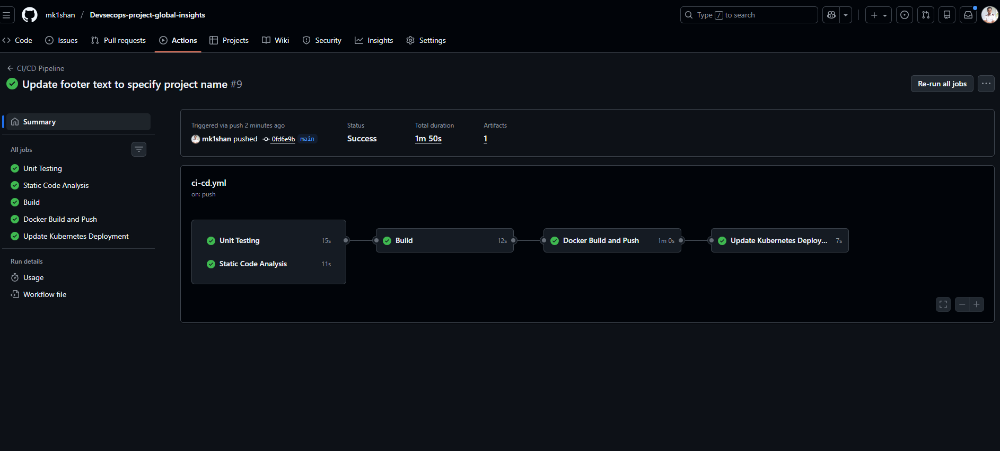
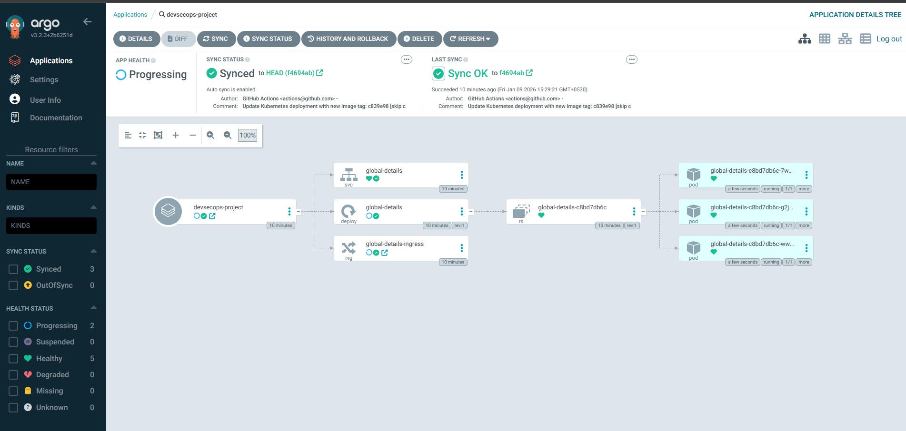
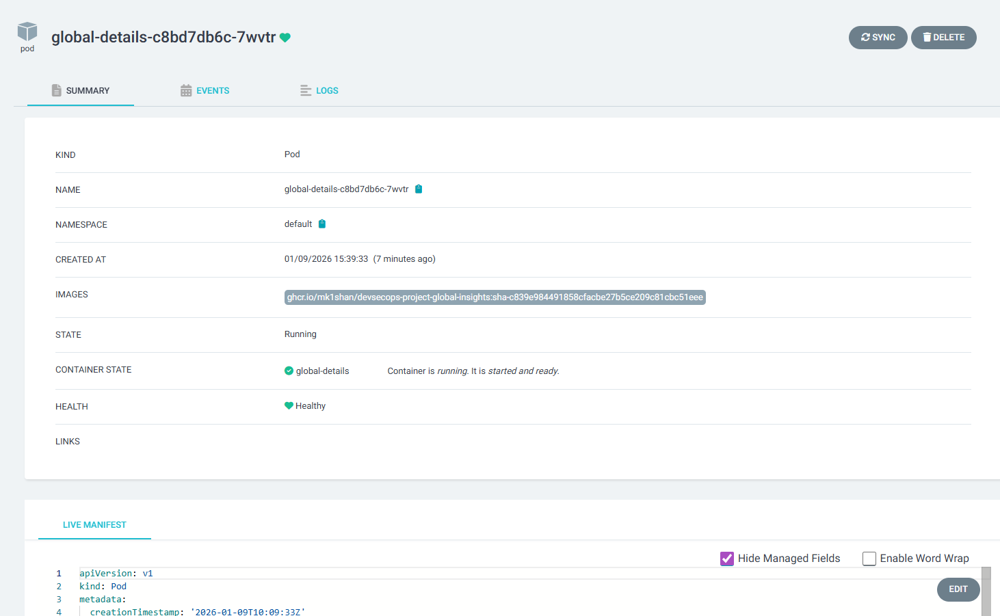

---

# DevSecOps CI/CD Pipeline: Global Insight Application

This project demonstrates a comprehensive **DevSecOps pipeline** for a React-based frontend application named **"Global Insight."** The pipeline automates the entire lifecycle from code commit to deployment on a **Kubernetes (kind)** cluster, incorporating security best practices and GitOps principles using **Argo CD**.

##  Project Overview

The goal of this project was to implement a secure, automated CI/CD workflow that ensures high code quality, container security, and seamless deployment.

### Key Features:

* **Source Code Management:** Hosted on GitHub.
* **CI/CD Engine:** GitHub Actions.
* **Security:** Static Code Analysis and Container Image Scanning.
* **Artifact Management:** GitHub Container Registry (GHCR).
* **Continuous Delivery:** Argo CD (GitOps).
* **Infrastructure:** Kubernetes cluster running on AWS EC2 via `kind`.

---

## 🛠 Tech Stack

* **Frontend:** React / Vite
* **CI/CD:** GitHub Actions
* **Containerization:** Docker
* **Orchestration:** Kubernetes (kind)
* **GitOps:** Argo CD
* **Security Tools:** Trivy (Image Scanning), ESLint (Static Analysis)

---

## 📉 Pipeline Workflow

The GitHub Actions workflow (`ci-cd.yml`) is triggered on every push to the `main` branch and consists of the following stages:

1. **Unit Testing:** Validates code functionality.
2. **Static Code Analysis:** Checks for code quality and security vulnerabilities in the source.
3. **Build:** Compiles the application and generates artifacts.
4. **Docker Build and Push:** Builds a Docker image and pushes it to **GitHub Container Registry (GHCR)**.
5. **Update Kubernetes Deployment:** Automatically updates the `deployment.yaml` file in the repository with the newly created image tag.


---

##  Proof of Implementation

### 1. Successful Pipeline Execution

The pipeline successfully passed all stages, including security checks and deployment manifest updates.



### 2. Secure Image Management

Images are stored securely in GHCR. A manual `docker run` was performed to verify image accessibility and container health.

### 3. GitOps with Argo CD

Argo CD was configured to monitor the repository. It detected the automated manifest changes and synchronized the cluster to the desired state.



### 4. Running Pods and Services

Verification of the live environment shows all application pods running healthily in the default namespace.



---

## 🌐 Final Application

The application is accessible through a secure tunnel via port-forwarding on port `3800`.


### Accessing the UI:

To view the live application, the following command was used to create a tunnel to the EC2 instance:

```bash
kubectl port-forward <pod-name> 3800:80 --address=0.0.0.0

```


---

## 📝 Key Commands Used

* **Create Secret for GHCR:** `kubectl create secret docker-registry github-container-registry ...`
* **Check Pods:** `kubectl get pods`
* **Port Forwarding:** `kubectl port-forward <pod-name> 3800:80 --address=0.0.0.0`
* **Decode Argo CD Password:** `echo <encoded-string> | base64 --decode`

---

**Developed by:** mk1shan | January 2026
